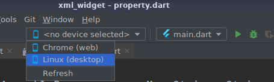
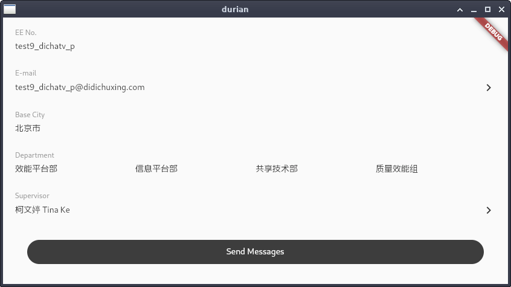
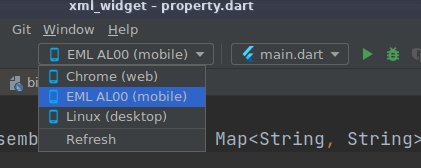
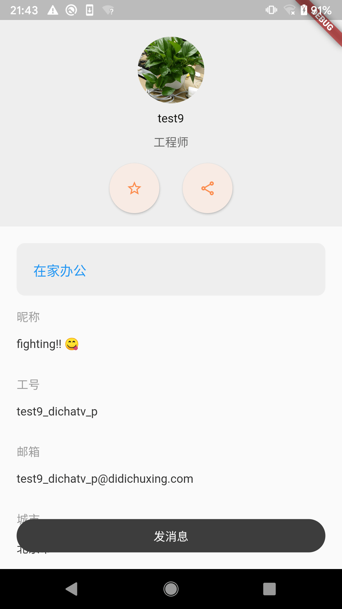

# Getting start

## run on pc

```sh
cd xml_widget/example
flutter run -d linux
```

or start it directly in Android Studio (open `xml_widget` as project):



show as below:



## run on android

open `xml_widget` directly in Android Studio:



show as below:



## run on iOS (TODO)

## run test

```sh
flutter test test/*.dart
```

# Introduction

`xml_widget` is a flutter library that could dynamically parse xml file into flutter widgets with javascript as execution engine.
It is still in development.

## similar to android's layout
Node name and attributes are exactly same with flutter widgets'.
```xml
<Center>
  <Column
    flutter:mainAxisAlignment="center">
    <Text
      flutter:data="Flutter Xml Widget"/>
    <Container
      flutter:margin="16dp"
      flutter:padding="16dp">
        <Text flutter:data="Text in a container"/>
    </Container>
  </Column>
</Center>
```
Very similar to Android's layout resources file if you did some android development! The attributes are just what corresponding widget have, with 'flutter:' as prefix. Equal dart code:
```dart
Center(
  child: Column(
    mainAxisAlignment: MainAxisAlignment.center,
    children: <Widget>[
      Text(
        'Flutter Xml Widget',
      ),
      Container(
        margin: EdgeInsets.all(16),
        padding: EdgeInsets.all(16),
        child: Text(
          'Text in a container',
        ),
      ),
    ],
  ),
)
```
Different from android's building xml as resource, `xml_widget` could directly read local xml file from device's storage. So you could download remote file from server and experience smooth GUI by flutter's high performance rendering!

## object properties

### simple property
some widget's property has a few sub-properties, such as `Container`'s `constraints`, we treat it as **simple property**, just using `.` to directly declare attributes in xml:
```xml
<Container
  flutter:constraints.minWidth="120dp"
  flutter:constraints.minHeight="40dp">
</Container>
```

### builtin resources
you could directly use some built-in color/theme/style already defined by flutter framework:
```xml
<Container
  flutter:color="@flutter:color/orangeAccent">
  <Text
    flutter:data="Flutter Xml Widget"
    flutter:style="@@flutter:theme/textTheme.headline4"/>
</Container>
```
`Container` would use `Colors.orangeAccent` as background and `Text` widget would apply `Theme.of(context).theme.textTheme.headline4`

### property override
want a slight change to given resource?
```xml
<Text
  flutter:style="@flutter:theme/textTheme.headline4"
  flutter:style.color="@flutter:color/red"/>
```
it corresponds dart's `copyWith`:
```dart
Text(
  style: Theme.of(context).textTheme.headline4.copyWith(color: Colors.red),
);
```

### custom color
if you hope to use your own color resource, just declare as follow in `colors.xml` placed in same directory with your layout xml:
```xml
<resources>
  <color name="orange">@flutter:color/orange</color>
  <color name="darkGreen">#1b8523</color>
  <color name="darkBlue">#1b5485</color>
</resources>
```
then using it without prefix:
```xml
<Container
  flutter:color="@color/orange">
  <Text
    flutter:data="Flutter Xml Widget"
    flutter:style="@flutter:theme/textTheme.headline4"
    flutter:style.color="@color/darkBlue"/>
</Container>
```
also support color state:
```xml
  <state name="color_state_text">
    <item flutter:color="@color/orange" flutter:state="hovered|focused"/>
    <item flutter:color="@color/darkGreen" flutter:state="dragged"/>
    <item flutter:color="@color/darkBlue"/>
  </state>
```
they were converted to dart's `MaterialStateProperty<Color?>` which some property needs.

### complex property (todo)
more styles and themes were expected to custom just like android:
```xml
<resources>
  <theme name="titleText" parent="flutter:textTheme.headline3">
    <color>#f0f</color>
    <backgroundColor>#f0f</backgroundColor>
    <fontSize>14sp</fontSize>
    <fontStyle>italic</fontStyle>
  </theme>
</resources>
```

```xml
  <Text
    flutter:data="Flutter Xml Widget"
    flutter:style="@theme/titleText" />
```

## databinding
If you are familiar with android development, you may use `databinding` to fill layout views with data by declaring variables in layout files. Actually it is very popular in front end world to describe views by template, especially in `Vue`. I borrowed its convention in `xml_widget`:
```xml
<Center>
  <Column
    flutter:mainAxisAlignment="center">
    <Text flutter:data="You have pushed the button this many times:"/>
    <Text flutter:data="{{something.some}}"
      flutter:style.color="@flutter:color/lightGreen"
      flutter:style="@theme/textTheme.headline4"/>
    <Text
      flutter:if="size < 0"
      flutter:data="size = {{size}}"
      flutter:style.color="@flutter:color/lightGreen"
      flutter:style="@theme/textTheme.headline4"/>
    <Text
      flutter:elseif="size == 0"
      flutter:data="size = {{size}}"
      flutter:style.color="@flutter:color/deepOrange"
      flutter:style="@theme/textTheme.headline4"/>
    <Text
      flutter:else=""
      flutter:data="size = {{size}}"
      flutter:style.color="@flutter:color/blueAccent"
      flutter:style="@theme/textTheme.headline4"/>
    <Flexible>
      <ListView>
        <Text
          flutter:data="header1"
          flutter:style.color="@flutter:color/orange"
          flutter:style="@theme/textTheme.headline2" />
        <Text
          flutter:data="header2"
          flutter:style.color="@flutter:color/blueAccent"
          flutter:style="@theme/textTheme.headline3" />

        <Text
          flutter:for="{{details}}"
          flutter:data="{{item.text}}"
          flutter:style.color="@flutter:color/deepOrangeAccent"
          flutter:style="@theme/textTheme.headline3" />
      </ListView>
    </Flexible>
  </Column>
</Center>
```
### variable
variable data is declared within `{{}}` just like vue, actually whole statement in `{{}}` would be given to script engine to evaluate, so it is legal to write an expression in it, like `{{size * 2 + 1}}`. If using a variable not defined in script context, an error message created by script engine would be shown instead without crashing.

### if statement
It is necessary to show different widget by `if-else` condition, in `xml_widget` this was also supported. Values of `flutter:if` and `flutter:elseif` would be given to script engine to evaluate. `flutter:elseif` and `flutter:else`  matching with nearest `flutter:if` would be considered as one condition groups. So it is legal to write multiple conditions within same parent.

`flutter:else` have to be assigned with `""` because of xml specification, different from `Vue`.

### for statement
List view was most important view in client development. Node declared with `flutter:for` in `ListView` means item-widget would be built and item data template starts with `item.`. Other children would be consider header or footer.

A `xml_widget` app's structure is very simple:
- a xml file representing view layout
- a js file doing control logic
- optional custom resource files

`xml_widget` depends on [xml](https://pub.flutter-io.cn/packages/xml) for xml file parsing and [flutter_js](https://pub.flutter-io.cn/packages/flutter_js) for js engine!


## supported widgets

- Text
- Column
- Row
- Wrap
- Container
- Ink
- RaisedButton
- FlatButton
- OutlineButton
- MaterialButton
- ElevatedButton
- TextButton
- OutlinedButton
- Padding
- InkWell
- Stack
- Flex
- Scaffold
- FloatingActionButton
- AppBar
- Icon
- Center
- IntrinsicWidth
- IntrinsicHeight
- Image
- Align
- AspectRatio
- FittedBox
- Baseline
- Positioned
- SizedBox
- Opacity
- ListView
- Flexible
- Expanded

# Architecture

more details in [architecture](example/docs/architecture.md)
